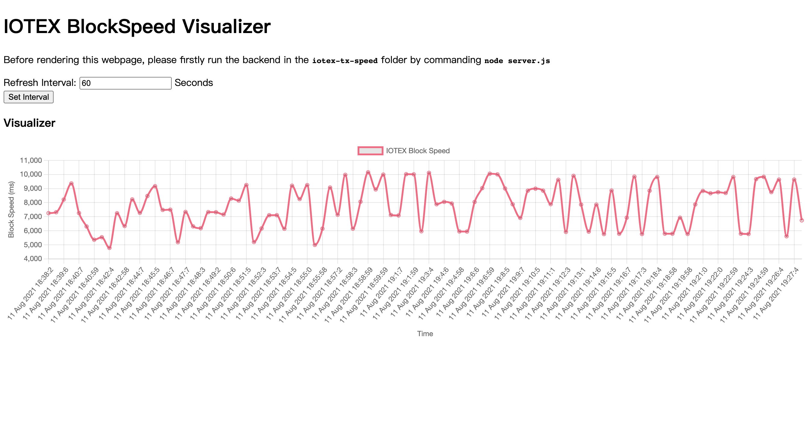

# iotex-block-speed

A live block speed measurement tool built for IOTEX.

Feature:

* Light-weighted and easy to modified
* Realtime monitoring (live)

**Any suggestion or possible improvement on this project is welcomed and appreciated! You can create a issue to contact me!**

## Installation

```
git clone https://github.com/Soptq/iotex-block-speed.git
cd iotex-block-speed
npm install
```

## Quick start

### Configure

```
vim src/iotex-block-speed/config.js
```

Here, we need two IOTEX test accounts (private key), where at least one of them has enough test IOTEX token to be transacted. It will normally cost `0.01` IOTX for a block speed test.

### Run backend

```
node src/iotex-block-speed/server.js
```

example output:

```
Start to test IOTEX block speed. Interval: 300 seconds
listening at http://localhost:3000


IOTEXBlockSpeedTester INFO:
------------------------------
Wallet_1:
	Balance: 1000
	Address: xxxxxxxxxxxxxxxxxxxxxxxxxxxxxxxxxxxxxxxxx
Wallet_2:
	Balance: 0
	Address: xxxxxxxxxxxxxxxxxxxxxxxxxxxxxxxxxxxxxxxxx

Warning: Based on your setting, IOTX in both accounts will be ran out in approximately 500000 minutes.
------------------------------
```

You can configure listening port and listening address at `server.js`.

### Check chart

Visualize the block speed chart at `http://localhost:3000`, or whatever you configured for `nodejs` to listen.


